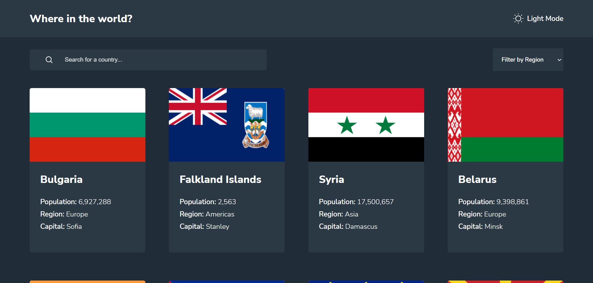

# Frontend Mentor - REST Countries API with color theme switcher solution

This is a solution to the [REST Countries API with color theme switcher challenge on Frontend Mentor](https://www.frontendmentor.io/challenges/rest-countries-api-with-color-theme-switcher-5cacc469fec04111f7b848ca). Frontend Mentor challenges help you improve your coding skills by building realistic projects.

## Table of contents

-   [Overview](#overview)
    -   [The challenge](#the-challenge)
    -   [Screenshot](#screenshot)
    -   [Links](#links)
-   [My process](#my-process)
    -   [Built with](#built-with)
    -   [Continued development](#continued-development)
-   [Author](#author)
-   [Acknowledgments](#acknowledgments)

## Overview

### The challenge

Users should be able to:

-   See all countries from the API on the homepage
-   Search for a country using an `input` field
-   Filter countries by region
-   Click on a country to see more detailed information on a separate page
-   Click through to the border countries on the detail page
-   Toggle the color scheme between light and dark mode _(optional)_

### Screenshot

### Links

-   Solution URL: https://github.com/ozzy1136/rest-countries-api-with-color-theme-switcher
-   Live Site URL: https://ozzy1136.github.io/rest-countries-api-with-color-theme-switcher/

## My process

### Built with

-   Semantic HTML5 markup
-   Flexbox
-   CSS Grid
-   Mobile-first workflow
-   [React](https://reactjs.org/) - JS library

### Continued development

My biggest takeaway from this project is that I need to learn to construct React components in a better and more efficient way. For example, one of the biggest challenges was managing focus when the country details page was opened. Although I settled on using document.getElementById() with the useRef hook, I feel like there should be a better "React way" of achieving this.

Additionally, figuring out where state should be managed from (e.g. input values, useRef references) became more difficult with the more components that needed to share state. Of course, these issues will be easier to understand and manage with pracice and reading code from experienced developers.

## Author

-   Website - Soon &rarr; [Ozmar Mendoza](https://ozzy1136.github.io/)
-   Frontend Mentor - [@ozzy1136](https://www.frontendmentor.io/profile/ozzy1136)
-   Twitter - [@11_crack](https://www.twitter.com/11_crack)

## Acknowledgments

-   [oleggrishechkin](https://github.com/oleggrishechkin)'s [react-viewport-list](https://github.com/oleggrishechkin/react-viewport-list) component - Critical for rendering only visible part of the countries list without clogging the dom with unnecessary elements

-   [World Wide Web Consortium](https://www.w3.org/WAI/)'s [Dialog Modal Example](https://www.w3.org/WAI/ARIA/apg/patterns/dialogmodal/) - Code from the example was used for the country details section in order to focus the back button on render
